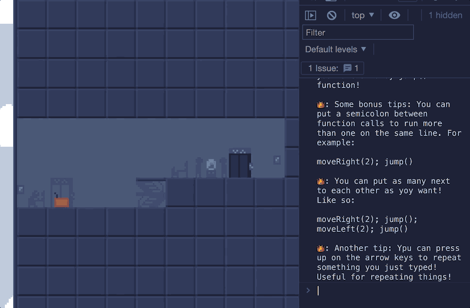

# Mission: Programmable!

Mission: Programmable is a game that teaches you programming!



# [Play here!](https://jezzamon.com/mission-programmable)

### PS: Make sure you see the ending of the game, there's something fun there for you :)

---

- Play a game entirely through the browser developer console.
- Receive mysterious instructions from an entity that identifies themselves as 👑Agent KB
- Learn to call functions and write loops in JavaScript!
- See the surprise ending?
- Have fun!

## How to play

To play this game, you'll need to open the developer console. There's a few ways to do that, but on most browsers, you can do that right clicking on this game, choosing "inspect" or "inspect element", and then choosing the "console" tab. [This website has detailed instructions for different browsers](https://www.coursera.support/s/article/learner-000001653-How-to-open-the-Javascript-console?language=en_US).

## Functions

- `moveRight()` moves the robot 1 tile to the right
- `moveRight(5)` moves the robot 5 tiles to the right (you can also use any other number)
- `moveLeft()` moves the robot 1 tile to the left
- `moveLeft(5)` moves the robot 5 tile to the left (you can also use any other number)
- `jump()` jumps once
- `open()` is used just once for a special purpose :)


- `mute()` toggles the sound and music


- `restart()` restarts the level
- `nextLevel()` skips to the next level
- `skipToEnd()` skips to the last level


## Want some hints?

I'll put together some hints and solutions to each level soon. Stay tuned!

---

## How to build things

Install npm, then run

```sh
npm i
npm build
```

## How to run locally

Run the two commands in different terminals:

```sh
npm run watch   # This watches for changes and automatically builds things when files change
npm run reload  # This runs a local web server that automatically refreshes when files change
```
